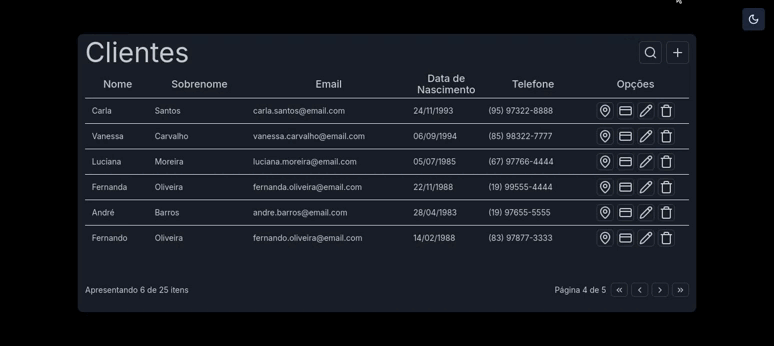
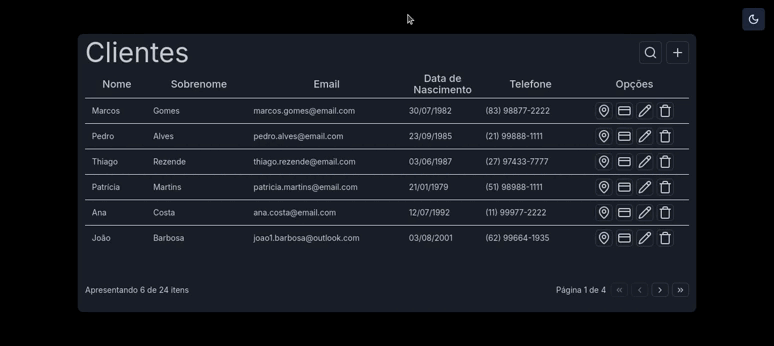
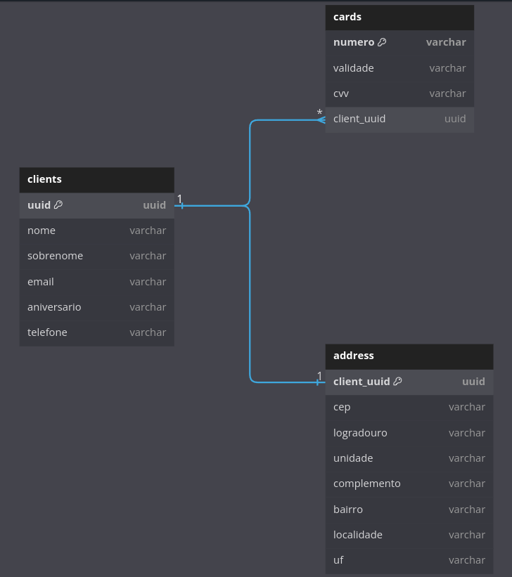

# client-manager-cc

Este projeto consiste na solução de um desafio técnico, que se trata de um CRUD de clientes com cartões de crédito.

## 📷 Demonstrações

### Dashboard

<div align="center">
  
</div>

### Quadro de Cartões

<div align="center">
  
</div>

### Responsividade

<div align="center">
  
</div>

## 🎲 Estrutura do Banco de Dados

<p align="center">

</p>

## 📱 Technologias

- **React**
- **Next.js**
- **TypeScript**
- **React Query**
- **React Hook Form**
- **Zod**
- **Tailwind**
- **Componentes do ShadCN**
- **Laravel**
- **MySQL**

## 🌐 Variáveis Ambiente

Para fins de praticidade e, visto que é um projeto que não irá para produção, optei por deixar as variáveis de ambiente padrões.

Logo, a única configuração necessária é mudar o nome do arquivo **.env.example** para **.env** e definir a **APP_KEY** do Laravel.

(Essas configurações são feitas automaticamente ao executar o arquivo **config.sh**)

## 🏁 Dependências

Para executar o projeto, e necessário ter as seguintes dependências instaladas:

- PHP (para gerar a APP_KEY do laravel).
- Docker
- Docker Compose V2

## 🏗 Setup

Para construir a aplicação, você pode executar o arquivo de configuração (Linux).

Primeiramente, dê permissão ao arquivo, com o seguinte comando na raiz do projeto:

```sh
chmod +x config.sh
```

Em seguida, execute-o:

```sh
./config.sh
```

Você também pode executar os comandos descritos no arquivo manualmente, se assim preferir.

# 🏃 Run

Ao construir a aplicação utilizando o arquivo de configuração, ele já deixará executando os containers Docker necessários para as aplicações.

## 📋 Endpoints

### Endpoints de Clientes

**GET /api/clients?per_page=15&page=2:** Lista páginada de clientes.

**GET /api/clients/{uuid}:** Retorna um cliente específico baseado no UUID passado como parâmetro.

**GET /api/clients/search?name=João&per_page=15&page=2:** Lista páginada de clientes com o filtro de pesquisa para o campo 'nome'.

**POST /clients:** Cria um novo cliente.

**PUT /clients/{uuid}:** Edita um cliente específico baseado no UUID.

**DELETE /clients/{uuid}:** Deleta um cliente específico baseado no UUID.

### Endpoints de Cartões

**GET /api/clients/{client_uuid}/cards?per_page=15&page=2:** Retorna uma lista paginada de cartões vinculados ao UUID passado como parâmetro.

**POST /api/cards:** Cria um novo cartão e o conecta a um cliente.

**DELETE /api/cards/{uuid}:** Deleta um cartão que possui o uuid passado como parâmetro.

### Endpoints de Endereços

**GET /api/addresses/{client_uuid}:** Retorna o endereço vinculado ao cliente com UUID passado como parâmetro.

**PUT /api/addresses/{client_uuid}:** Verifica se o cliente com UUID passado como parâmetro possui um endereço vinculado à ele. Se tiver ele atualiza e senão ele cria um novo.

**DELETE /api/addresses/{client_uuid}:** Deleta o endereço que está vinculado ao cliente cujo UUID foi passado como parâmetro.
