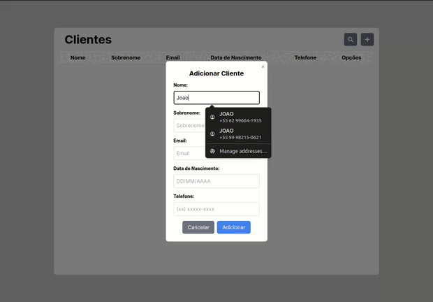
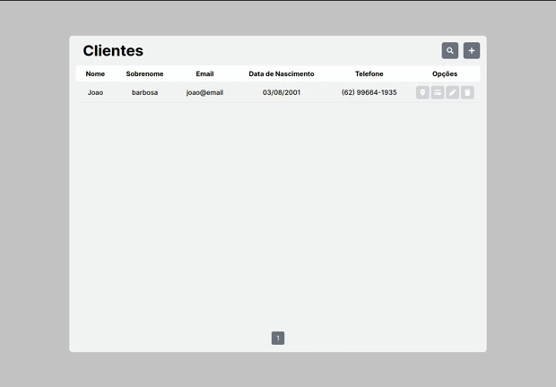

# client-manager-cc

Este projeto consiste na solução de um desafio técnico, que se trata de um CRUD de clientes com cartões de crédito.

## 📷 Demonstrações

### Dashboard

<div align="center">
  
  
</div>

### Quadro de Cartões

<div align="center">
  
  
</div>

## 🎲 Estrutura do Banco de Dados

<p align="center">

</p>

## 📱 Technologias

- **React**
- **Next.js**
- **TypeScript**
- **Tailwind**
- **Laravel**
- **MySQL**

## 🌐 Variáveis Ambiente

Para fins de praticidade e, visto que é um projeto que não irá para produção, optei por deixar as variáveis de ambiente padrões.
Logo, a única configuração necessária é mudar o nome do arquivo **.env.example** para **.env**.

## 🏁 Dependências

Para executar o projeto, e necessário ter as seguintes dependências instaladas:

- Node.js
- NPM
- Yarn
- PHP
- Composer
- Docker

## 🏗 Setup

Para construir a aplicação, você pode executar o arquivo de configuração (Linux).

Primeiramente, dê permissão ao arquivo, com o seguinte comando na raiz do projeto:

```sh
chmod +x config.sh
```

Em seguida, execute-o:

```sh
./config.sh
```

Você também pode executar os comandos descritos no arquivo manualmente, se assim preferir.

# 🏃 Run

Ao construir a aplicação utilizando o arquivo de configuração, ele já deixará executando os containers Docker necessários para a aplicação Laravel e finalizará com a aplicação Next.js em execução no terminal.

Você pode usar o comando CTRL+C para finalizar a execução do frontend.

Digite o comando cd ../backend seguido de ./vendor/bin/sail down para parar o backend.

## 📋 Endpoints

### Endpoints de Clientes

**GET /clients:** Lista todos os clientes.
**POST /clients:** Cria um novo cliente.
**GET /clients/{uuid}:** Retorna um cliente específico baseado no UUID passado como parâmetro.
**PUT /clients/{uuid}:** Edita um cliente específico baseado no UUID.
**DELETE /clients/{uuid}:** Deleta um cliente específico baseado no UUID.

### Endpoints de Cartões

**POST /cards:** Cria um novo cartão e o conecta a um cliente.
**GET /cards/{uuid}:** Retorna uma lista de cartões vinculados ao UUID passado como parâmetro.
**DELETE /cards/{numero}:** Deleta um cartão que possui o número passado como parâmetro.

### Endpoints de Endereços

**POST /addresses:** Cria um novo endereço e o conecta a um cliente.
**GET /addresses/{uuid}:** Retorna o endereço vinculado ao UUID passado como parâmetro.
**PUT /addresses/{uuid}:** Edita o endereço específico baseado no UUID.
