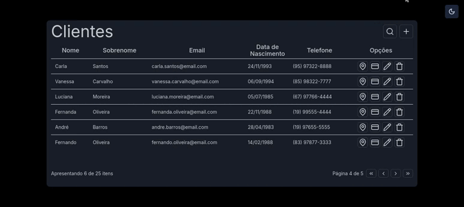
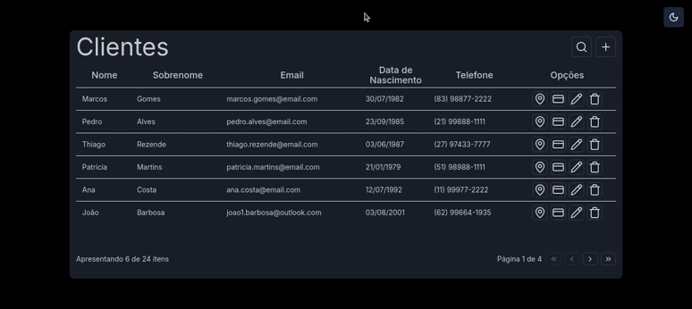
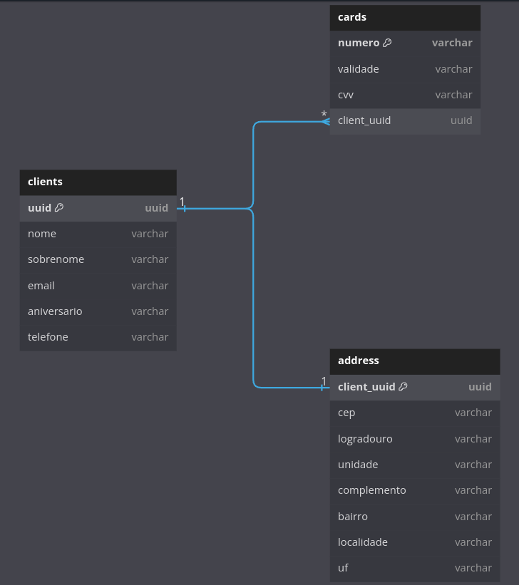

# 💳 Client Manager

> A full-stack technical challenge: a client + credit-card CRUD with address management — a Laravel API behind a Next.js frontend, fully containerized.

## 📋 Overview

Solution to a full-stack technical challenge: manage clients, their credit cards, and their
addresses. Paginated listing and search on the client side, with a typed TypeScript
frontend and a Laravel REST API.

## 🚀 Tech Stack

| Layer | Technology |
|-------|-----------|
| **Frontend** | React, Next.js, TypeScript, React Query, React Hook Form, Zod, Tailwind, shadcn/ui |
| **Backend** | Laravel (PHP) |
| **Database** | MySQL |
| **Runtime** | Docker / Docker Compose |

## 📷 Demo

<div align="center">
  <br/>
  <br/>
  
</div>

Database schema:

<p align="center"></p>

## 🔧 How to Run Locally

**Prerequisites:** PHP + Composer (to generate the Laravel `APP_KEY`), Docker, Docker
Compose V2.

A `config.sh` script prepares the `.env` (from `.env.example`), sets the `APP_KEY`, and
starts the containers:

```bash
chmod +x config.sh
./config.sh
```

(The steps can also be run manually.)

## 📡 API Reference

**Clients** — `GET /api/clients` (paginated), `GET /api/clients/search?name=...`,
`GET /api/clients/{uuid}`, `POST /api/clients`, `PUT /api/clients/{uuid}`,
`DELETE /api/clients/{uuid}`.

**Cards** — `GET /api/clients/{uuid}/cards` (paginated), `POST /api/cards`,
`DELETE /api/cards/{uuid}`.

**Addresses** — `GET /api/addresses/{client_uuid}`, `PUT /api/addresses/{client_uuid}`
(upsert), `DELETE /api/addresses/{client_uuid}`.

## 👤 Author

**João Barbosa** — Software Engineer (backend / platform).
[LinkedIn](https://www.linkedin.com/in/joao1barbosa/) · [GitHub](https://github.com/joao1barbosa)
